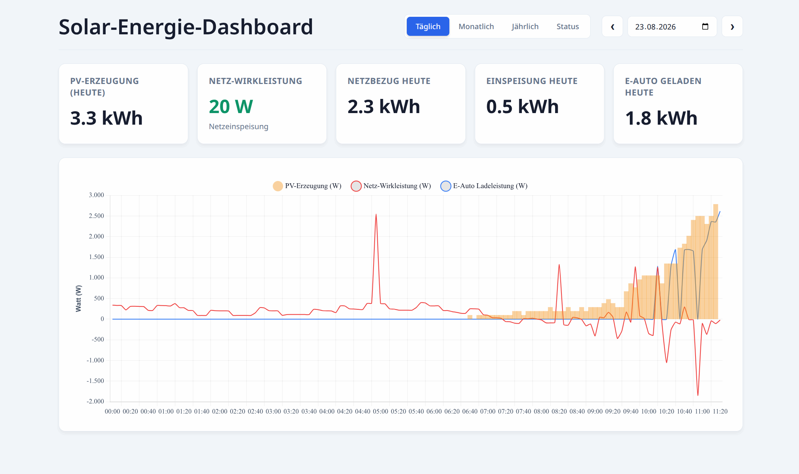

# Webapp

The `webapp/` directory contains a static dashboard for viewing P1 grid data
and SMA PV data. It must be served by a web server. Opening `index.html`
directly from the file system will not work reliably because the dashboard
loads its data with HTTP requests.

## Dashboard preview



The image is documentation only and is not needed for the dashboard to run.

## Directory layout

The web server document root should contain the webapp files and these two
data directories:

```text
web-root/
|-- index.html
|-- app.js
|-- p1.js
|-- pv.js
|-- ... other webapp files ...
|-- p1/
|   |-- p1_data-20260819.csv
|   |-- p1_data-202608.csv
|-- pv/
    |-- pv_data-20260819.csv
    |-- pv_data-202608.csv
```

For example, from the repository root, copy or link the data directories
into `webapp/` and serve that directory:

```bash
cd webapp
python3 -m http.server 8000
```

Open `http://localhost:8000/` in a browser. The server must allow the files
in `/p1/` and `/pv/` to be read, and should return the CSV files as plain
text. HTTPS is recommended when the dashboard is accessed from another
machine.

## Required web server settings

The included `.htaccess` is intended for Apache HTTP Server with these
modules enabled:

- `mod_auth_form`, `mod_authn_file`, `mod_authz_core`, and `mod_session` for
    form login and sessions.
- `mod_rewrite` for the virtual `/webapp/dologin` endpoint.
- `mod_headers` for restricting financial yield values.

The configured password file is `/usr/local/websecure/.htpasswd`. Create it
with Apache's password tool and add one account for each permitted user, for
example:

```bash
sudo mkdir -p /usr/local/websecure
sudo htpasswd -c /usr/local/websecure/.htpasswd admin
sudo htpasswd /usr/local/websecure/.htpasswd dashboard-user
```

Change the `Secret` value in `.htaccess` before using the webapp in
production:

```apache
SessionCookieName solar_session path=/webapp/ Secret=replace-with-a-long-random-value
```

All authenticated users can view the dashboard. Financial yield values are
shown only to usernames listed in the `X-Yield-Access` expression in
`.htaccess`:

```apache
Header set X-Yield-Access "true" "expr=%{REMOTE_USER} =~ m#^(admin|energy-manager)$#"
```

Replace the usernames inside the regular expression with the accounts that
should see yield values. Users not matching the expression can still use the
dashboard, but the yield card remains hidden. Keep the `X-Yield-Access`
response header rule unchanged because the webapp uses it to apply this
permission.

The `login.html` page and icons are public so unauthenticated visitors can
reach the login form. The dashboard and its CSV data remain protected by
`Require valid-user`. A simple server such as `python3 -m http.server` does
not provide this authentication or permission behavior and should only be
used for local, non-sensitive testing.

## Required filenames

The dashboard uses these filenames. `YYYYMMDD` is the date and `YYYYMM` is
the month, both without separators.

| Data | Daily file | Monthly file |
| --- | --- | --- |
| P1 | `p1/p1_data-YYYYMMDD.csv` | `p1/p1_data-YYYYMM.csv` |
| PV | `pv/pv_data-YYYYMMDD.csv` | `pv/pv_data-YYYYMM.csv` |

An optional typical monthly PV distribution can be provided:

| Distribution | File |
| --- | --- |
| Yearly profile by month | `pv/yearly-distribution.csv` |

The daily profile is always calculated dynamically in the browser from the
average of the last seven completed PV days. This accounts for the actual
sunrise and sunset times from recent days. The monthly profile is read from
the file or, if the file is missing, calculated from available monthly PV
files from up to five previous years.

The P1 controller creates files with these names when its base path is
`p1_data.csv` (the default). The JavaScript also accepts the older
`p1-data-...` spelling and several SMA export names for compatibility; use
the names above for a new setup.

## File formats

### P1 CSV files

P1 files are comma-separated CSV files. The daily file contains cumulative
meter readings and instantaneous power:

```text
timestamp,import_kwh,export_kwh,active_power_w
2026-08-19 12:00:00,1234.567,456.789,850
```

`import_kwh` and `export_kwh` are cumulative meter values. `active_power_w`
is the current grid power in watts; positive means importing and negative
means exporting. The monthly file contains one daily total per row:

```text
date,import_kwh,export_kwh
2026-08-19,12.345,4.567
```

### PV CSV files

PV files use the semicolon-separated SMA export format. The dashboard reads
the timestamp from column 1 and the value from column 3. Decimal commas are
accepted and PV values are interpreted as kW.

```text
sep=;
dd.MM.yyyy HH:mm:ss;Time;Power
19.08.2026 12:00:00;12:00:00;4,250
```

Daily PV files are normally recorded at five-minute intervals. Monthly PV
files contain daily totals, using the same date and value columns. SMA
metadata and header lines are ignored.

## Adjusting filenames

If your files use different names or directories, update the path lists in
`p1.js` and `pv.js` to match the files exposed by the web server. Because the
paths start with `/p1/` and `/pv/`, they are resolved relative to the web
server document root.
